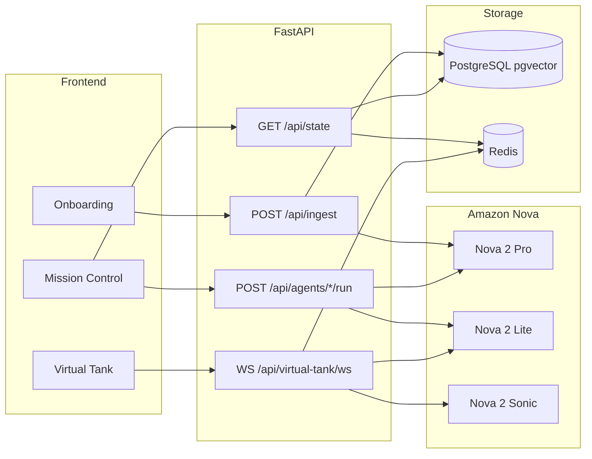

# Backend PRD Review: Founder's Flight Deck (Amazon Nova)

## 1. Current state vs PRD

| Area             | Current backend                                                                                                                                                                 | PRD proposal                                                                                                       |
| ---------------- | ------------------------------------------------------------------------------------------------------------------------------------------------------------------------------- | ------------------------------------------------------------------------------------------------------------------ |
| **Ingestion**    | [backend/app/routers/ingest.py](backend/app/routers/ingest.py): POST `/api/ingest`, returns full `SharedWorkspace`; no Nova, no embeddings                                      | Nova Pro doc analysis → Venture DNA → pgvector; return `workspace_id` + Health Score (0–100)                       |
| **State**        | [backend/app/routers/state.py](backend/app/routers/state.py): GET `/api/state` returns `SharedWorkspace`                                                                        | Same GET `/api/state`; backend "drives the Orbs"                                                                   |
| **Agents**       | [backend/app/routers/agents.py](backend/app/routers/agents.py): POST `/api/agents/{market-intel,asset-forge,vc-scout,code-lab,finance-auditor}/run` → returns `SharedWorkspace` | Describes 3 specialists by name (Market Intel, Finance Auditor, Code Lab); logic via Nova Pro/Lite + Tavily/Serper |
| **Virtual Tank** | [backend/app/routers/virtual_tank.py](backend/app/routers/virtual_tank.py): WebSocket `/api/virtual-tank/ws`; mock stream of `SharkPersonaMessage` (no user audio, no Nova)     | Nova Lite (chat) + Nova Sonic (TTS); barge-in after 2s silence; stream text + audio; metadata packet               |
| **Storage**      | [backend/app/storage.py](backend/app/storage.py): single `state.json` file                                                                                                      | PostgreSQL (pgvector) + Redis (Virtual Tank sessions)                                                              |

Frontend expectations are defined in [frontend/src/lib/types/sharedWorkspace.ts](frontend/src/lib/types/sharedWorkspace.ts) and [frontend/src/context/SharedWorkspaceContext.tsx](frontend/src/context/SharedWorkspaceContext.tsx): `SharedWorkspace` (including all five orbs), `SharkPersonaMessage`, and `NEXT_PUBLIC_BACKEND_URL` / `NEXT_PUBLIC_VIRTUAL_TANK_WS_URL`.

---

## 2. Alignment and gaps

### 2.1 Ingestion (POST /api/ingest)

- **Path**: Matches. Frontend calls `POST ${BACKEND_BASE_URL}/ingest` with `FormData` (file) ([frontend/app/onboarding/page.tsx](frontend/app/onboarding/page.tsx)).
- **Response**: PRD says "Return workspace_id and Health Score (0–100)". Frontend currently does not read the response body; it calls `refreshFromBackend()` (GET `/api/state`) after upload and navigates to Mission Control. So you can add `workspace_id` and `health_score` without breaking the frontend. Recommendation: either extend the ingest response with `{ workspace_id, health_score }` and keep returning the full `SharedWorkspace` (so frontend can keep current flow and optionally show health score from state), or document that `SharedWorkspace.fundability_score` is the Health Score and add `workspace_id` to state or response.

### 2.2 GET /api/state and specialist orbs

- **State shape**: PRD and frontend agree: a single workspace state object. Current [backend/app/schemas.py](backend/app/schemas.py) `SharedWorkspace` already has `market_intel`, `asset_forge`, `vc_scout`, `code_lab`, `finance_auditor`, `virtual_tank`, `fundability_score`, etc. No change needed to the contract.
- **Specialist list**: PRD names three specialists (Market Intelligence, Finance Auditor, Code Lab). The frontend has five orbs and already calls run endpoints for: Market Intelligence, Asset Forge, VC Scout, Code Lab, Finance Auditor. Recommendation: explicitly add **Asset Forge** and **VC Scout** to the PRD (with Nova Pro / external APIs as needed) so the backend continues to support all five orbs.

### 2.3 Virtual Tank WebSocket (/api/virtual-tank/ws)

- **URL**: Matches. Frontend uses `ws://localhost:8000/api/virtual-tank/ws` (or `NEXT_PUBLIC_VIRTUAL_TANK_WS_URL`) ([frontend/src/hooks/useVirtualTankStream.ts](frontend/src/hooks/useVirtualTankStream.ts)).
- **Message shape**: PRD metadata example: `{ "shark_id": 1, "isSpeaking": true, "text": "..." }`. Frontend expects [SharkPersonaMessage](frontend/src/lib/types/sharedWorkspace.ts): `shark_id: string`, `display_name`, `role`, `color`, `text`, `is_barge_in`. So:
  - Keep **string** `shark_id` (e.g. `"hawk"`, `"visionary"`, `"tech-giant"`) to match frontend; backend already uses these in [virtual_tank.py](backend/app/routers/virtual_tank.py).
  - Add or keep `display_name`, `role`, `color`, `is_barge_in` in every message so the UI can render tiles and barge-in styling. PRD’s `isSpeaking` can be implied by “last message from this shark” or added as an optional field.
- **Audio**: PRD says stream audio bytes via Nova Sonic. Today the WebSocket sends only JSON. You will need either: (a) a second WebSocket or HTTP stream for audio, or (b) a multiplexed protocol (e.g. binary frame type for audio vs text for JSON). Frontend currently plays a static greeting ([pitchgreeting.mp3](frontend/public/audio/pitchgreeting.mp3)); it does not consume backend-streamed audio yet. Plan for a small frontend change to play streamed audio (e.g. MediaSource or pre-agreed binary format).

### 2.4 Barge-in and session state

- **Barge-in**: PRD “user stops talking for >2 seconds → Shark Attack” implies the backend receives **user audio** (or VAD/silence events). Current WebSocket is server→client only. You need client→server messages (e.g. audio chunks or “silence” events) and server-side VAD or silence detection to trigger the 2s rule. Document this in the PRD.
- **Session history**: PRD says “Session history stored in Redis”. That fits with per-session conversation history for Nova Lite and RAG; the existing file-based state can remain for SharedWorkspace, with Redis keyed by `workspace_id` or session id for Virtual Tank only.

---

## 3. Data model: Mission Graph vs SharedWorkspace

- PRD’s **Mission Graph** (PostgreSQL + pgvector) is a new backend store: `id`, `founder_name`, `venture_dna` (problem, solution, target_market, financials), `vector_id` (embedding). The current **SharedWorkspace** is the API contract for the app (orbs, fundability_score, etc.). Recommendation: keep both: Mission Graph as the ingested “brain” and source for RAG; SharedWorkspace (or a view of it) as what GET `/api/state` and the orbs use. Add a mapping from workspace/session to Mission Graph row (e.g. workspace_id → mission_graph_id) and optionally store `health_score` / `fundability_score` on the Mission Graph or in workspace state.
- **Embedding dimension**: PRD shows `vector(1536)`. Confirm the actual Nova (or Bedrock) embedding dimension for your chosen model and use that in pgvector.

---

## 4. Amazon Nova naming and APIs

- Public naming is **Nova 2** family: **Nova 2 Pro**, **Nova 2 Lite**, **Nova 2 Sonic** (Bedrock). PRD’s “Amazon Nova Pro/Lite/Sonic” is understood; implementation should use the exact Bedrock model IDs (e.g. `amazon.nova-2-pro-v1:0`, `amazon.nova-2-lite-v1:0`) and the **Nova 2 Sonic** speech docs for TTS/streaming.
- **Nova Sonic**: Use “speech-to-speech” and “Text-to-Speech” as in PRD; for <800 ms round-trip, use streaming (e.g. InvokeModelWithBidirectionalStream or the streaming TTS API per AWS docs). Guardrails: use Amazon Nova’s safety filters as specified in the PRD.

---

## 5. Security and ephemeral workspace

- **Guardrails**: PRD’s “sharks stay Shark Tank professional” and “avoid toxic language” maps to Nova safety/config; implement via Bedrock model invocation parameters.
- **24h auto-wipe**: “Ephemeral storage… auto-wipe workspace_id after 24 hours” should be spelled out: what is deleted (Mission Graph row, Redis keys, any file state) and how (scheduled job or TTL). If using Redis TTL for session data, set keys to expire in 24h; for PostgreSQL, a daily job or `workspace_id` + `created_at` cleanup.

---

## 6. Architecture sketch (high level)

---

## 7. Summary of PRD updates to consider

| Item                       | Recommendation                                                                                                                                                 |
| -------------------------- | -------------------------------------------------------------------------------------------------------------------------------------------------------------- |
| **Ingest response**        | Add `workspace_id` and `health_score`; keep returning `SharedWorkspace` (or document `fundability_score` as health).                                           |
| **Specialists**            | Name all five orbs in the PRD: Market Intelligence, Asset Forge, VC Scout, Code Lab, Finance Auditor.                                                          |
| **Virtual Tank metadata**  | Use existing `SharkPersonaMessage` (string `shark_id`, `display_name`, `role`, `color`, `text`, `is_barge_in`); add `isSpeaking` only if frontend will use it. |
| **Audio streaming**        | Specify protocol (second channel vs binary frames) and frontend contract for Nova Sonic streamed bytes.                                                        |
| **Barge-in**               | Specify client→server messages (audio or VAD) and 2s silence rule on the server.                                                                               |
| **Nova naming**            | Use “Nova 2 Pro”, “Nova 2 Lite”, “Nova 2 Sonic” and Bedrock model IDs in implementation.                                                                       |
| **Mission Graph vs state** | Keep Mission Graph as internal store + RAG; keep SharedWorkspace as the external state API.                                                                    |
| **24h wipe**               | Define scope (Redis TTL, PG cleanup) and mechanism (cron or TTL).                                                                                              |

Once these are reflected in the PRD, the document will be aligned with the existing frontend and backend and ready for implementation with Amazon Nova and the new storage stack.

---

## 8. Implementation phases (execution order)

Implement in this order. Phase 1 is first so the app uses mocks by default and you only spend AWS credits when capturing real responses.

| Phase | Name                               | Goal                                                                                                                                                  |
| ----- | ---------------------------------- | ----------------------------------------------------------------------------------------------------------------------------------------------------- |
| **1** | Toggle-to-Mock                     | Config, mock save/load utility, Bedrock client; apply to existing routers so Real/Mock paths share the same Pydantic schemas (frontend never breaks). |
| **2** | Foundation and data infrastructure | PostgreSQL plus pgvector, Redis; MissionGraph schema; Bedrock client verification.                                                                    |
| **3** | Intelligent ingestion              | Nova 2 Pro document analysis, Venture DNA, embeddings, Health Score to fundability_score.                                                             |
| **4** | Specialist orb agency              | All 5 orbs with RAG and Nova Pro/Lite.                                                                                                                |
| **5** | Virtual Tank                       | WebSocket binary plus JSON, Nova Lite plus Sonic, barge-in, frontend audio.                                                                           |
| **6** | Polish, security and deployment    | Guardrails, 24h TTL plus PG prune, deploy (e.g. App Runner/EC2).                                                                                      |

---

**Model ID note (use in Phase 2):** Embeddings: `amazon.nova-2-multimodal-embeddings-v1:0` (dimension 1024). Nova Pro/Lite/Sonic: `amazon.nova-2-pro-v1:0`, `amazon.nova-2-lite-v1:0`, `amazon.nova-2-sonic-v1:0`. DEMO TRUE = real AWS and save to mocks; FALSE = load from mocks.

(Removed redundant semantics paragraph.) when the flag is **TRUE** → call real AWS and save response to mocks; when **FALSE** → load from mocks (no AWS). So `DEMO_* = True` = “real”, `False` = “mock”. Consider renaming to `USE_REAL_NOVA`** or `MOCK`** (True = mock) for clarity; implementation below follows your exact convention.

---

### Phase 1: Toggle-to-Mock (do first — save AWS credits)

For every LLM/Sonic invocation: if DEMO flag **TRUE** then call real Bedrock and save response to mocks; if **FALSE** then do not call AWS, load from mocks. Apply to **existing router files**, **starting with Bedrock client initialization**. Execution order within Phase 1: (1) Bedrock client init, (2) config and mock utility, (3) POST /api/ingest, (4) same pattern on other routers as later phases are built.

#### 1.1 Central config

- **File:** `backend/app/config.py`
- **Environment variables (as you specified):**
  - `DEMO_GLOBAL` (bool): If True, override all per-feature flags to True (use real AWS everywhere). If False or unset, per-feature flags apply.
  - `DEMO_INGEST` (bool): Ingest (Nova 2 Pro).
  - `DEMO_FINANCE` (bool): Finance Auditor.
  - `DEMO_TANK` (bool): Virtual Tank (Nova Lite + Sonic).
  - Optionally `DEMO_CODE_LAB` (bool) for code_gen (or rely on `DEMO_GLOBAL` for Code Lab).
- Default every flag to **False** so that with no env set, the app uses mocks and spends no credits.
- Parse via `os.getenv("DEMO_INGEST", "false").lower() in ("true", "1")` or `pydantic-settings`.

---

#### 1.2 Mock save/load utility

- **File:** e.g. `backend/app/services/mock_io.py` (or `backend/app/utils/mock_storage.py`).
- **Contract:** One file per service function: `backend/data/mocks/[function_name]_latest.json` (and for audio, e.g. `[function_name]_latest.audio` or base64 inside JSON).
- **Functions:**
  - `save_mock_response(function_name: str, data: dict | bytes)` — writes raw JSON (or binary to `.audio`). Used by the **real** path after every Bedrock call to persist the response.
  - `load_mock_response(function_name: str, kind: "json" | "audio")` — reads and returns the data. Used by the **mock** path; if file missing, return safe default or raise a clear error (“Run once with DEMO_INGEST=true to generate mock”).
- **Rule:** Real path wraps the Bedrock response in this utility to save; mock path loads via this utility. Same structure so both paths feed the same Pydantic models.

---

#### 1.3 Per–service-function rules

For **every** service function (e.g. `analyze_document`, `shark_response`, `code_gen`):

1. **Check the specific DEMO flag** (or `DEMO_GLOBAL`).
2. **If TRUE:** Invoke the real Boto3/Bedrock SDK for Amazon Nova 2. Wrap the response in the utility that **saves** the raw JSON (and Audio if applicable) to `backend/data/mocks/[function_name]_latest.json` (and `.audio` if needed).
3. **If FALSE:** Do **not** call AWS. Load and return the data from `backend/data/mocks/[function_name]_latest.json`.
4. **Ensure Pydantic schemas remain identical** between Real and Mock paths so the **frontend never breaks**.

---

#### 1.4 Bedrock client (start here)

- **File:** `backend/app/services/bedrock_client.py` (or `backend/app/clients/bedrock.py`).
- Initialize `boto3.client("bedrock-runtime")`; read config from `config.py`. The client is used only when the corresponding `DEMO`_* or `DEMO_GLOBAL` is True; otherwise the router/service layer uses the mock loader and never instantiates the client (or uses a lazy/no-op client).
- Apply this in the **existing** app layout so routers can import the client and config.

---

#### 1.5 Apply first to POST /api/ingest (existing router)

- **Implement first** for the **POST /api/ingest** route using **Nova 2 Pro**, ensuring the **Venture DNA structure is captured perfectly during the first TRUE run.**
- **Refactor:** Move “analyze document + build state” into a service function, e.g. `analyze_document(file: bytes, filename: str)`.
  - **Real branch (`DEMO_INGEST` or `DEMO_GLOBAL` True):** Call Nova 2 Pro, parse response into Venture DNA (problem, solution, target_market, financials). Save the **raw** response (or canonical dict with `venture_dna`) via `save_mock_response("analyze_document", ...)`. Build `SharedWorkspace` from that and return.
  - **Mock branch (False):** Load via `load_mock_response("analyze_document")`, parse into the same Venture DNA schema, then run the **same** “build SharedWorkspace from Venture DNA” logic so the API response is identical.
- **Router:** Update **existing** [backend/app/routers/ingest.py](backend/app/routers/ingest.py) to call this service; keep returning `SharedWorkspace` (and optionally `workspace_id`, `health_score`). No change to the frontend contract.

---

#### 1.6 Venture DNA schema

- **File:** `backend/app/schemas.py`
- Define a Pydantic model **Venture DNA** (e.g. `problem`, `solution`, `target_market`, `financials`) so that:
  - The real ingest pipeline (Nova 2 Pro) returns this and it is what gets saved to `analyze_document_latest.json`.
  - The mock path loads that JSON into this model; both paths then build the same `SharedWorkspace`. Identical schemas → frontend never breaks.

---

#### 1.7 Later: apply to existing router files (same pattern)

- **Finance Auditor** ([backend/app/routers/agents.py](backend/app/routers/agents.py)): `DEMO_FINANCE`; function e.g. `finance_audit`; save/load `finance_audit_latest.json`.
- **Code Lab** (same file): `DEMO_CODE_LAB` or `DEMO_GLOBAL`; function e.g. `code_gen`; save/load `code_gen_latest.json`.
- **Virtual Tank** ([backend/app/routers/virtual_tank.py](backend/app/routers/virtual_tank.py)): `DEMO_TANK`; e.g. `shark_response` (JSON) + `shark_response_latest.audio` for Sonic. Same `SharkPersonaMessage` and optional audio so frontend never breaks.

---

#### 1.8 Phase 1 file checklist

- Add `backend/app/config.py` (env: `DEMO_GLOBAL`, `DEMO_INGEST`, `DEMO_FINANCE`, `DEMO_TANK`; optional `DEMO_CODE_LAB`).
- Add `backend/app/services/__init__.py`, `backend/app/services/bedrock_client.py` (Bedrock client init first), `backend/app/services/mock_io.py` (save_mock_response / load_mock_response).
- Add `backend/app/services/ingest_service.py`: `analyze_document()` with real/mock branches using the utility; shared “Venture DNA → SharedWorkspace” mapping.
- Add `VentureDNA` (and if needed `IngestResult`) in `backend/app/schemas.py`.
- Ensure `backend/data/mocks/` exists; add `.gitkeep` and optionally a seed `analyze_document_latest.json` for devs who never run real ingest.
- Update **existing** `backend/app/routers/ingest.py` to call the service; response shape unchanged.

---

### Phase 2: Foundation and data infrastructure

**Goal:** Move from `state.json` to PostgreSQL plus Redis; MissionGraph; Bedrock client verified.

- **2.1** Provision PostgreSQL with pgvector; Redis for WebSocket/session state.
- **2.2** MissionGraph table: `id`, `founder_name`, `venture_dna` (JSONB), `embedding` **vector(1024)**. Keep SharedWorkspace as the public API contract (no breaking frontend changes).
- **2.3** Bedrock: verify access to `amazon.nova-2-pro-v1:0`, `amazon.nova-2-lite-v1:0`, `amazon.nova-2-sonic-v1:0`. Embeddings: use `**amazon.nova-2-multimodal-embeddings-v1:0`** (dimension **1024**).

---

### Phase 3: Intelligent ingestion

**Goal:** Replace mock ingestion with Nova 2 Pro document analysis and embeddings.

- **3.1** POST /api/ingest: send uploaded file to Nova 2 Pro; prompt for Venture DNA (Problem, Solution, Target Market, Financials).
- **3.2** Embedding: send extracted text to `amazon.nova-2-multimodal-embeddings-v1:0` (1024 dims); store in pgvector.
- **3.3** Return `workspace_id`; map Health Score to `fundability_score` for frontend. All behind Phase 1 toggle (DEMO_INGEST / DEMO_GLOBAL).

---

### Phase 4: Specialist orb agency

**Goal:** Power all 5 Mission Control orbs with Nova and RAG.

- **4.1** Market Intelligence and VC Scout: RAG using MissionGraph embeddings for context.
- **4.2** Asset Forge and Code Lab: Nova 2 Pro for narrative/code blueprint.
- **4.3** Finance Auditor: deterministic logic plus Nova 2 Lite for Shark-style critique. Wire each through Phase 1 DEMO flags (DEMO_FINANCE, DEMO_CODE_LAB, etc.).

---

### Phase 5: Virtual Tank (real-time multimodality)

**Goal:** Low-latency, speech-enabled pitch simulation.

- **5.1** WebSocket `/api/virtual-tank/ws`: binary frames (audio) plus JSON frames (metadata); same `SharkPersonaMessage` contract.
- **5.2** Nova 2 Lite for text; pipe into Nova 2 Sonic to stream audio (under 800 ms target).
- **5.3** Barge-in: server-side timer; if no client audio for over 2 s, trigger Shark Attack (idle shark asks). Client must send audio or VAD.
- **5.4** Frontend: play incoming PCM/Opus via Web Audio API. Behind DEMO_TANK.

---

### Phase 6: Polish, security and deployment

**Goal:** Hackathon-ready and safe.

- **6.1** Amazon Bedrock Guardrails: Shark Tank professional, PII filter.
- **6.2** 24h ephemeral: Redis TTL 24h; FastAPI background task to prune PG where `created_at < NOW() - INTERVAL '24 hours'`.
- **6.3** Deploy to AWS App Runner or EC2 to reduce latency to Bedrock.

